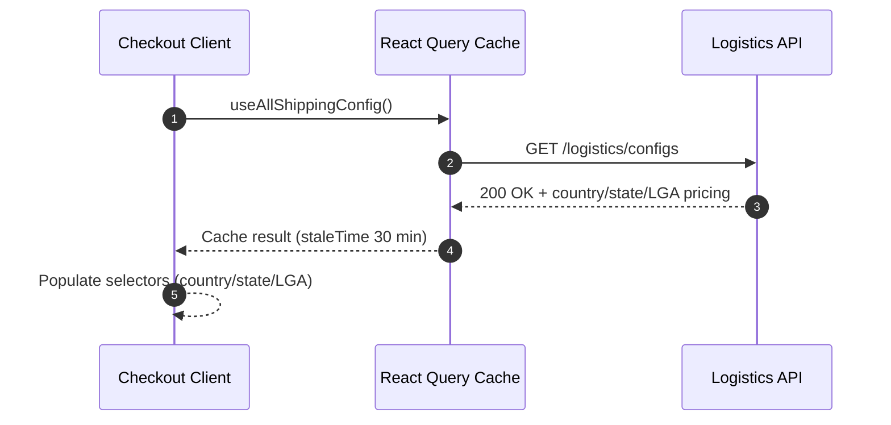
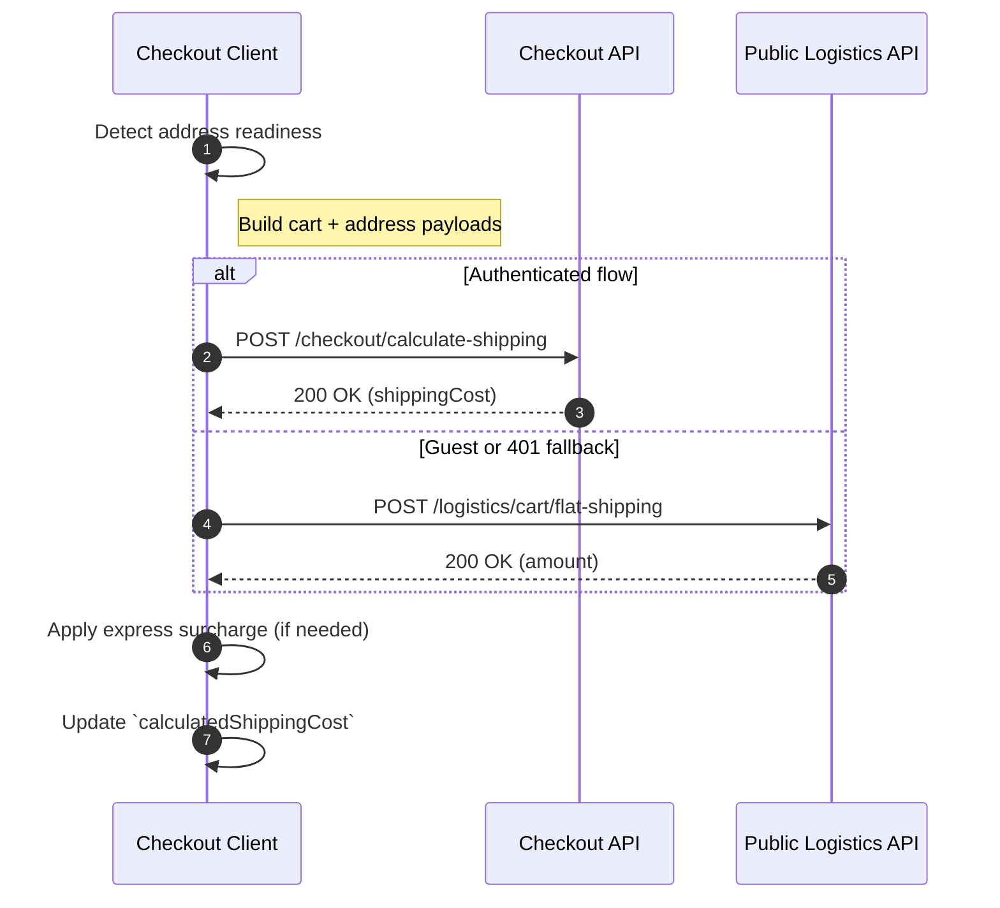
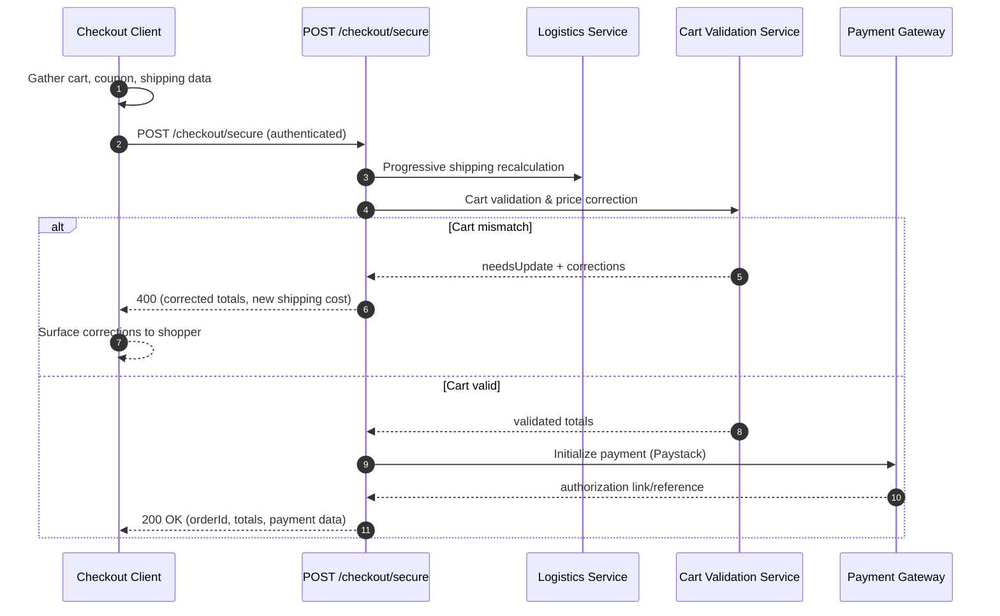

# Checkout Flow

This document explains the storefront checkout pipeline, focusing on how the Next.js client coordinates with backend APIs to gather shipping metadata, calculate delivery costs, and progress toward payment.

## Key Actors

| Actor                                                        | Responsibility                                                                                                  |
| ------------------------------------------------------------ | --------------------------------------------------------------------------------------------------------------- |
| Checkout Client (Next.js App Router)                         | Renders the checkout experience, manages local shipping form state, and orchestrates API calls via React Query. |
| Cart API (`api.cart.*`)                                      | Supplies the current cart items, quantities, and totals.                                                        |
| Logistics API (`/logistics/*`)                               | Exposes shipping configuration data (countries, states, LGAs, pricing metadata).                                |
| Checkout API (`/checkout/*`)                                 | Performs authenticated shipping cost calculations and payment initialization.                                   |
| Public Logistics Quote API (`/logistics/cart/flat-shipping`) | Provides fallback shipping quotes for guest users or unauthenticated sessions.                                  |

## High-Level Flow

1. **Cart Snapshot** – The client loads cart contents using `useCart()`, ensuring the order summary reflects the current basket.
2. **Shipping Configuration Prefetch** – `useAllShippingConfig()` retrieves the country → state → city/LGA tree along with price/ETA metadata so selectors can be populated immediately.
3. **Shipping Method Selection** – User picks between `pickup`, `normal`, or `express`. Non-pickup methods expand the shipping info form.
4. **Shipping Form Completion** – The client tracks form state locally. Separate readiness flags gate UI concerns:
   - `isShippingAddressReady` (state, LGA/city, street, postal code, country) triggers shipping quote requests.
   - `isShippingFormComplete` (address + contact fields) unlocks the "Proceed to Payment" CTA.
5. **Shipping Cost Calculation** – When address data is ready and cart items exist:
   - Authenticated users call `/checkout/calculate-shipping`.
   - Guest users (or 401 fallbacks) call `/logistics/cart/flat-shipping`.
   - Express mode applies a surcharge multiplier (`EXPRESS_SURCHARGE_MULTIPLIER`).
6. **Order Review** – Totals combine subtotal, discount, and computed shipping cost; errors surface inline.
7. **Secure Checkout** – When the shopper proceeds, the client posts the validated cart snapshot to `/checkout/secure`, allowing the backend to re-price items, recompute shipping, and initialize payment.
8. **Payment Initiation** – The successful `/checkout/secure` response returns a Paystack (or configured gateway) payment link/reference that the client uses to continue the payment journey.

## Sequence: Config Prefetch



## Sequence: Shipping Cost Calculation



## Sequence: Secure Checkout & Payment Init



## Client Form State

- The form keeps a single `shippingForm` object with keys: `firstName`, `lastName`, `email`, `phoneNumber`, `country`, `state`, `lga`, `city`, `streetAddress`, `postalCode`.
- Dependent selections reset subordinate fields (e.g., changing `country` clears `state` & `lga`).
- `city` is required independently, even when an LGA is selected; the shipping quote payload prefers explicit city but falls back to LGA if absent.

## API Payload Snapshots

- **Authenticated Shipping Payload** (`/checkout/calculate-shipping`):

  ```json
  {
    "items": [
      {
        "product": "<productId>",
        "qty": 2,
        "selectedAttributes": [ ... ],
        "unitPrice": 15000,
        "totalPrice": 30000
      }
    ],
    "shippingAddress": {
      "country": "Nigeria",
      "state": "Lagos",
      "city": "Ikeja"
    },
    "deliveryType": "shipping"
  }
  ```

- **Public Shipping Payload** (`/logistics/cart/flat-shipping`):

  ## Secure Checkout Payload Snapshot
  - **Request** (`/checkout/secure` - authenticated):

    ```json
    {
      "items": [
        {
          "product": "<productId>",
          "qty": 2,
          "selectedAttributes": [{ "name": "Color", "value": "Black" }],
          "unitPrice": 15000,
          "totalPrice": 30000
        }
      ],
      "shippingAddress": {
        "firstName": "Ada",
        "lastName": "Okafor",
        "email": "ada@example.com",
        "phoneNumber": "+2348012345678",
        "country": "Nigeria",
        "state": "Lagos",
        "city": "Ikeja",
        "streetAddress": "12 Aromire Avenue",
        "postalCode": "100271"
      },
      "deliveryType": "shipping",
      "subtotal": 30000,
      "total": 31500,
      "totalDiscount": 0,
      "taxPrice": 0,
      "couponCodes": [],
      "shippingCost": 1500,
      "estimatedShipping": { "cost": 1500, "days": 3 }
    }
    ```

  - **Success Response**:

    ```json
    {
      "message": "Secure checkout completed successfully",
      "data": {
        "orderId": "65f1c8f4f78b9c0012e8d123",
        "order": {
          "total": 31500,
          "subtotal": 30000,
          "couponDiscount": 0,
          "shippingPrice": 1500,
          "deliveryType": "shipping",
          "status": "Pending",
          "isPaid": false
        },
        "validation": {
          "priceValidated": true,
          "totalDiscrepancy": 0
        },
        "payment": {
          "authorizationUrl": "https://paystack.com/pay/...",
          "reference": "PSK_xyz",
          "amount": 31500,
          "currency": "NGN"
        }
      }
    }
    ```

  - **Correction Response (HTTP 400)**: Returns `needsUpdate: true` with corrected cart totals and reason strings (e.g., shipping cost updated) when backend adjustments are required.

  ```json
  {
    "items": [{ "productId": "<productId>", "quantity": 2 }],
    "destination": {
      "countryName": "Nigeria",
      "stateName": "Lagos",
      "stateCode": "Lagos",
      "lgaName": "Ikeja",
      "cityName": "Ikeja"
    }
  }
  ```

## Error Handling & UX

- Calculation failures surface via `handleApiError` and present inline banners under the shipping total.
- Shipping method badge communicates completion status and allows method switching without losing form data.
- Calculations run automatically whenever the address changes; a cancellation guard prevents state updates on unmounted components.

## Future Hooks

1. Integrate payment initiation once shipping is confirmed, leveraging cached cart + address data.
2. Persist shipping address for authenticated users to reuse on future orders.
3. Surface ETA data from `LogisticsLocationConfig` in the order summary alongside cost.
